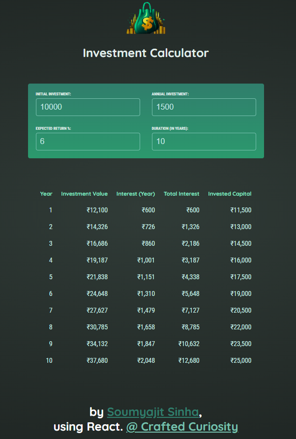

# React Investment Calculator

A simple React application to calculate the growth of investments over time, based on initial investment, annual contributions, expected return, and investment duration. This project demonstrates controlled React inputs, state management, and lifting state up to a parent component.

---

## Features

* **Dynamic input fields:** Users can set the initial investment, annual investment, expected return rate, and duration.
* **Controlled components:** All input values are managed in the parent component state.
* **Real-time updates:** Input changes are immediately reflected in the app.
* **Results component:** Designed to display calculated investment results .

---

## Screenshots



---

## Installation

1. Clone the repository:

   ```bash
   git clone https://github.com/yourusername/react-investment-calculator.git
   cd react-investment-calculator
   ```

2. Install dependencies:

   ```bash
   npm install
   ```

3. Run the development server:

   ```bash
   npm run dev
   ```

4. Open your browser at `http://localhost:5173/react-investment-calculator/`.

---

## Usage

1. Enter your **Initial Investment**, **Annual Investment**, **Expected Return %**, and **Duration (in years)**.
2. Values will update in real-time.
3. Extend the `Results` component to calculate and display the total future investment value based on inputs.

---

## Project Structure

```
react-investment-calculator/
│
├─ src/
│  ├─ assets/         # Images and logos
│  ├─ components/
│  │   ├─ UserInput.jsx   # Controlled input component
│  │   └─ Results.jsx     # Component to display calculated results
│  ├─ index.css
│  ├─ index.jsx
|  └─ App.js    # Main application
│
├─ package.json
└─ README.md
```

---

## Technologies

* React 18
* JavaScript (ES6+)
* Vite for development
* HTML5 & CSS3

---

## Future Improvements

* Deploy to GitHub Pages or Netlify.

---

## License

This project is open-source and available under the MIT License.
